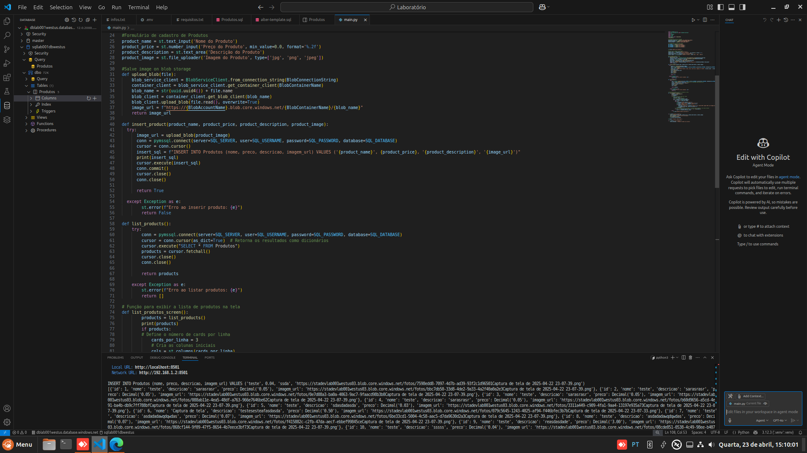

# Cadastro de Produtos com Streamlit e Azure

Este projeto é um aplicativo simples de cadastro de produtos desenvolvido usando Streamlit, Azure Blob Storage e Azure SQL Server. O objetivo do aplicativo é permitir que os usuários cadastrem produtos, incluindo nome, preço, descrição e imagem, e visualizem uma lista dos produtos cadastrados.

## Tecnologias Utilizadas

- **Streamlit**: Biblioteca para criação de aplicações web interativas em Python.
- **Azure Blob Storage**: Serviço de armazenamento de objetos para armazenar imagens dos produtos.
- **Azure SQL Server**: Banco de dados relacional para armazenar informações dos produtos.
- **Python**: Linguagem de programação utilizada para desenvolver a lógica do aplicativo.

## Funcionalidades

1. **Cadastro de Produtos**: O usuário pode preencher um formulário com as informações do produto e fazer upload de uma imagem, que será armazenada no Azure Blob Storage.
2. **Listagem de Produtos**: O usuário pode visualizar todos os produtos cadastrados em um formato de cartão, mostrando nome, descrição, preço e imagem.
3. **Persistência de Dados**: Os dados dos produtos são salvos em um banco de dados SQL Server.

## Estrutura do Código

O código está estruturado em funções que manipulam a lógica de cadastro e listagem de produtos:

- `upload_blob(file)`: Função que faz o upload da imagem do produto para o Azure Blob Storage e retorna a URL da imagem.
- `insert_product(product_name, product_price, product_description, product_image)`: Função que insere um novo produto no banco de dados.
- `list_products()`: Função que recupera todos os produtos cadastrados do banco de dados.
- `list_produtos_screen()`: Função que exibe os produtos na interface do Streamlit.

## Capturas de Tela

## Insights e Possibilidades

Durante o desenvolvimento deste projeto, aprendi várias coisas importantes:

1. **Integração com Serviços Azure**: Aprendi como integrar serviços de armazenamento e banco de dados na nuvem, o que permite escalar aplicações de maneira eficiente.
2. **Uso do Streamlit**: A facilidade de uso do Streamlit para criação de interfaces web rápidas e interativas é incrível. Ele permite que desenvolvedores criem protótipos de forma ágil.
3. **Boas Práticas de Segurança**: A importância de usar variáveis de ambiente para armazenar credenciais sensíveis, como strings de conexão, foi um aprendizado significativo.
4. **Validação de Dados**: Considerar a validação de dados de entrada é crucial para evitar problemas de injeção de SQL e garantir a integridade dos dados.
5. **Design Responsivo**: O uso de colunas no Streamlit para exibir produtos em um layout responsivo é uma técnica útil para melhorar a experiência do usuário.

## Possíveis Melhorias

- **Validação de Formulário**: Implementar validações mais robustas nos campos de entrada do formulário.
- **Paginação de Produtos**: Adicionar funcionalidade de paginação para lidar com um grande número de produtos cadastrados.
- **Autenticação de Usuário**: Implementar um sistema de autenticação para permitir que apenas usuários autorizados possam cadastrar ou listar produtos.
- **Edição e Exclusão de Produtos**: Adicionar funcionalidades para editar ou excluir produtos já cadastrados.

## Conclusão

Este projeto foi uma grande oportunidade de aplicar os conhecimentos adquiridos ao longo do curso e explorar a integração de tecnologias de nuvem e desenvolvimento web. Estou animado para expandir as funcionalidades deste aplicativo e explorar mais sobre o desenvolvimento de aplicações com Streamlit e Azure.
